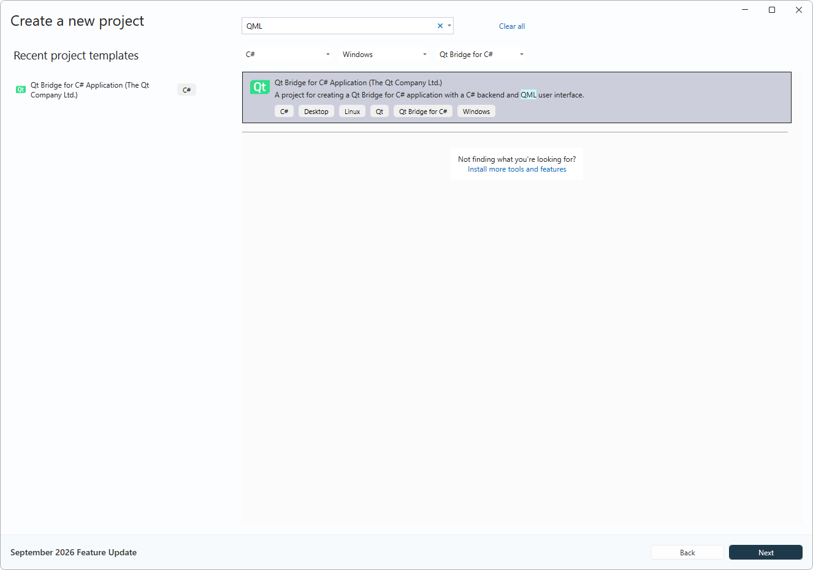
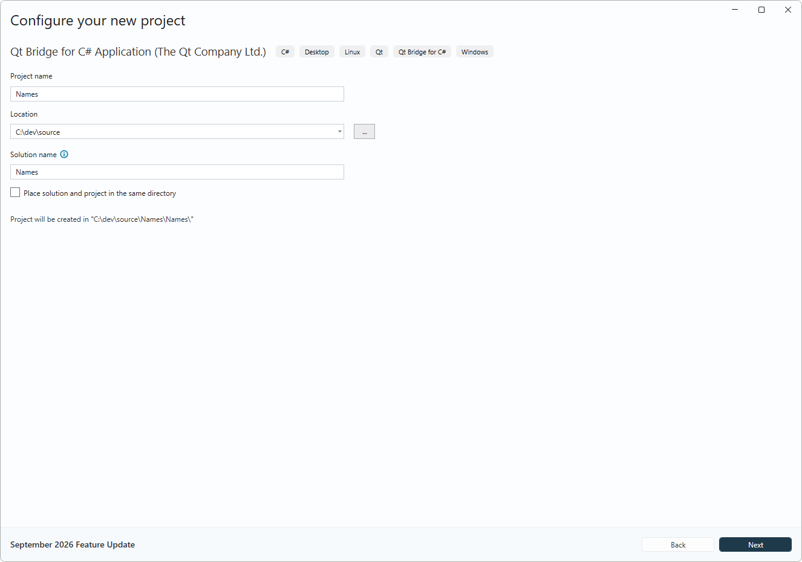
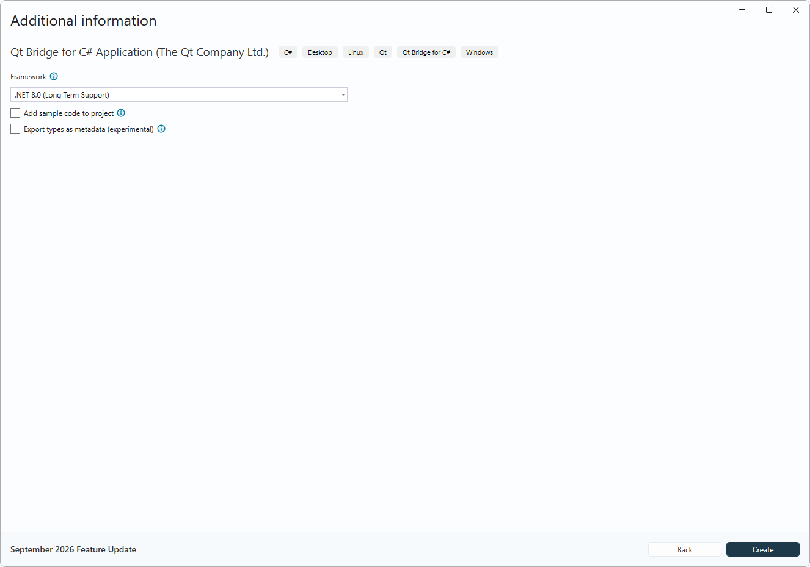
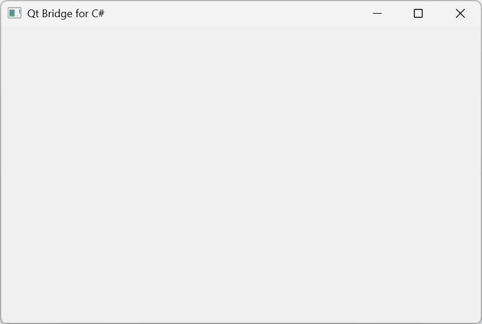
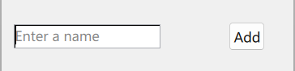
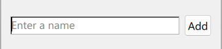
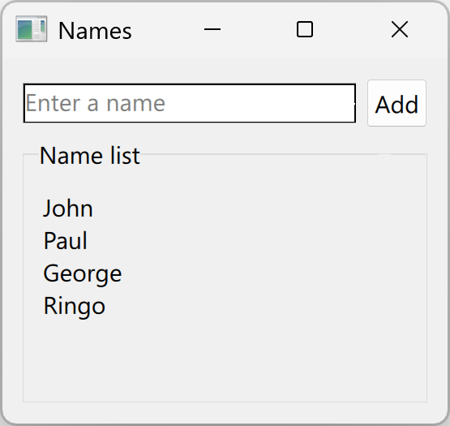
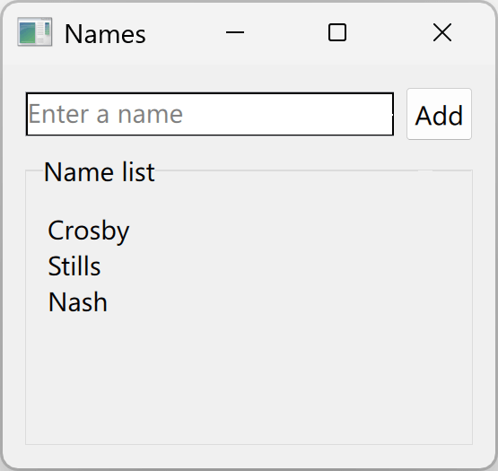
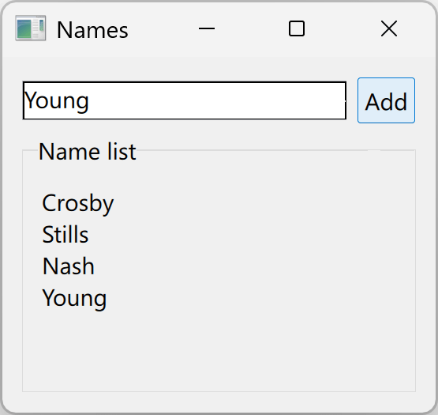

# Tutorial: Create C# and QML app


This tutorial shows how to create a C# and Qt Quick (QML) app that adds names to a list.
You can design the UI in QML and write the back-end logic in C#.

You will learn how to:

* Create a C# + QML app from scratch
* Design an app UI in QML
* Write back-end functionality in C#
* Instantiate .NET object in QML
* Use .NET lists as a data model in QML


## Prerequisites

* [Visual Studio 2026](https://visualstudio.microsoft.com/downloads/?utm_medium=microsoft&utm_source=learn.microsoft.com&utm_campaign=inline+link&0utm_content=download+vs2026+desktopguide+winforms) installed with the
following workloads:

    * .NET desktop development
    * Desktop development with C++

To install Qt Bridge for C#, install its templates package and use the included project template:

* [Windows and Visual Studio](https://doc-snapshots.qt.io/qtbridge-csharp/getting-started-windows-visual-studio.html)
* [Project Templates](https://doc-snapshots.qt.io/qtbridge-csharp/templates-and-examples.html)

## Create a C# + QML app

To create a new C# + QML application in Visual Studio, follow the steps:

* Select the option to create a new project: **File** > **New** > **Project/Solution**
* In the new project dialog, filter by C#, Windows, and Qt Bridge for C# or Qt to find the Qt Bridge for C# application template.
* Select the Qt Bridge for C# Application project template:

  
* Next
* In the Configure your new project window, set the Project name to Names and press Next:

  

* In the Additional information window, leave the Add sample code to project check-box
  unchecked and press Create:

  

After Visual Studio generates the project, you can open the `Main.qml` and `Program.cs` files
to examine the code that was added by default to the project.

## Examine the QML

After creating the project, the file `Main.qml` will contain a minimal amount of
QML code required to display an empty window:

```qml
import QtQuick
import QtQuick.Controls

ApplicationWindow {
    id: win
    visible: true
    title: "Qt Bridge for C#"
    width: 640; height: 480
}
```

QML is a declarative language that describes user interfaces through their visual components.
See [Getting started with Qt Quick applications](https://doc.qt.io/qt-6/qmlapplications.html) and [The QML Reference](https://doc.qt.io/qt-6/qmlreference.html) for more information.

The QML code that creates our app's window:

* `import QtQuick`: Imports the QtQuick module, which provides all the basic types necessary
  for creating user interfaces with QML
* `import QtQuick.Controls`: Imports the QtQuick.Controls module, which provides a set of
  controls that can be used to build complete interfaces in QML, including the ApplicationWindow
* `ApplicationWindow {...}`: Creates the root ApplicationWindow object.
  All other UI elements will be nested in this root object.
* `id: win`: Sets the [id attribute](https://doc.qt.io/qt-6/qtqml-syntax-objectattributes.html#the-id-attribute) to win.
  This will allow other objects to identify and refer to the ApplicationWindow object in expressions such as win.title or win.show().
* `visible: true`: Makes the window [visible](https://doc.qt.io/qt-6/qml-qtquick-window.html#visible-prop)
* `width: 640` and `height: 480`: Sets the window initial [width and height](https://doc.qt.io/qt-6/qml-qtquick-window.html#height-prop)
* `title: "Qt Bridge for C#"`: Sets the window title.

## Change the window

To see how the default app looks, press F5 to build and run the application. An empty window will appear after the successful build.



To change the window size and title:

* Change the title of the window by setting its title property to "Names"
* Change the size of the window by setting the width to 220 and the height to 180

```qml
import QtQuick
import QtQuick.Controls
ApplicationWindow {
    id: win
    visible: true
    title: "Names"
    width: 220; height: 180
}
```

## Prepare the layout

QML provides several ways to [position UI elements](https://doc.qt.io/qt-6/qtquick-positioning-topic.html).
This tutorial uses [anchors](https://doc.qt.io/qt-6/qtquick-positioning-anchors.html) and
[layout objects](https://doc.qt.io/qt-6/qtquicklayouts-overview.html).

Layout objects automatically place and resize their child items, which
makes them well suited for responsive UIs. [`GridLayout`](https://doc.qt.io/qt-6/qml-qtquick-layouts-gridlayout.html)
arranges child items in rows and columns, placing them in the order they're defined. The
[`columns`](https://doc.qt.io/qt-6/qml-qtquick-layouts-gridlayout.html#columns-prop) property controls how many columns
to fill before wrapping to the next row.

To set up the grid layout:

* At the top of `Main.qml`, import the [`QtQuick.Layouts`](https://doc.qt.io/qt-6/qtquicklayouts-index.html) module:

```qml
  import QtQuick.Layouts
```

* Inside the `ApplicationWindow`, add a `GridLayout` with two
  columns:

```qml
  GridLayout {
      columns: 2
      anchors.fill: parent
      anchors.margins: 10
}
```
* Set the grid's [`anchors.fill`](https://doc.qt.io/qt-6/qml-qtquick-item.html#anchors.fill-prop) to fill the parent window:

```qml
  anchors.fill: parent
```

* Set the grid's [`anchors.margins`](https://doc.qt.io/qt-6/qml-qtquick-item.html#anchors.margins-prop) to define an overall margin of 10.

```qml
  anchors.margins: 10
```

## Add the first controls

Add [`TextField`](https://doc.qt.io/qt-6/qml-qtquick-controls-textfield.html) and [`Button`](https://doc.qt.io/qt-6/qml-qtquick-controls-button.html) to the grid.

To add a text field to the grid create a `TextField` object as follows:

- Implicitly placed in the first row and first column of the grid.
- With `id` set to `name`.
- With the UI focus by default.
- With a placeholder text prompting the user to enter a name.

```qml
  TextField {
      id: name
      focus: true
      placeholderText: "Enter a name"
  }
```

To add a button after the `TextField`, create a `Button` object as follows:

- Implicitly placed in the first row and second column of the grid.
- With the text "Add".

```qml
  Button {
      text: "Add"
  }
```

The `GridLayout` code looks like this:

```qml
GridLayout {
    columns: 2
    anchors.fill: parent
    anchors.margins: 10

    TextField {
        id: name
        focus: true
        placeholderText: "Enter a name"
    }

    Button {
        text: "Add"
    }
  }
```

The layout output should look like this:



### Fine tune the layout

The layout objects will automatically place and resize their nested items. To fine-tune the automatic placement,
a nested item can specify [attached properties](https://doc.qt.io/qt-6/qtqml-typesystem-attachedtypes.html#attached-properties)
that the containing layout object will then use to adjust the placement and size of the item.
For controls placed inside a `GridLayout`, this includes the following attached properties:

| Property | Description |
| --- | --- |
| [`Layout.columnSpan`](https://doc.qt.io/qt-6/qml-qtquick-layouts-layout.html#columnSpan-attached-prop) | Number of cells in the same row that the item will span |
| [`Layout.rowSpan`](https://doc.qt.io/qt-6/qml-qtquick-layouts-layout.html#rowSpan-attached-prop) | Number of cells in the same column that the item will span |
| [`Layout.fillHeight`](https://doc.qt.io/qt-6/qml-qtquick-layouts-layout.html#fillHeight-attached-prop) | If set `true`, the item expands vertically while respecting the given constraints |
| [`Layout.fillWidth`](https://doc.qt.io/qt-6/qml-qtquick-layouts-layout.html#fillWidth-attached-prop) | If `true`, the item expands horizontally while respecting the given constraints |

Add `Layout.fillWidth` attached property to the `TextField` to ensure it is laid out as wide as possible.

```qml
TextField {
    id: name
    focus: true
    placeholderText: "Enter a name"
    Layout.fillWidth: true
}
```

The text field will now be wider, including the cell margin and the "Add" button's size.



## Create the name list

To create the UI for the list of names, inside the grid, and after the `Button` control,
add a `GroupBox` to show a border and a title for the list:

- Set `title` to `"Name list"`
- Set both `Layout.fillWidth` and `Layout.fillHeight` to `true`
- Set `Layout.columnSpan` to 2

Add a `ListView` inside the `GroupBox`

- Set to fill the content area of the parent `GroupBox` with `anchors.fill: parent`

```qml
  GroupBox {
      title: "Name list"
      Layout.fillWidth: true; Layout.fillHeight: true
      Layout.columnSpan: 2

      ListView {
          anchors.fill: parent
      }
  }
```

### Populating the `ListView`

In QML, view controls such as `ListView` that display a collection of data items will follow the [models, views, and delegates](https://doc.qt.io/qt-6/qtquick-modelviewsdata-modelview.html) architecture.
In this architecture, objects provide access to data items in a collection, View objects are responsible for displaying the item collection as a whole, and Delegate objects are
responsible for rendering the visual representation of each data item.

To display a list of names in the `ListView` that you created, you need to specify both a model that will
provide access to the list and also a delegate that will know how to display each name. To test this out, you can use a
fixed list of strings as a model, and define a delegate that will display each string inside a Text control.

```qml
ListView {
    anchors.fill: parent
    model: [ "John", "Paul", "George", "Ringo" ]
    delegate: Text {
        required property string modelData
        text: modelData
    }
}
```

The above `delegate` will be applied to each data item in the collection — in this case, each string in the list of strings.
A delegate must declare the [required properties](https://doc.qt.io/qt-6/qtqml-syntax-objectattributes.html#required-properties) of data items,
and these properties can then be used to access information about each data item. If the collection items are primitive values, such as in the
case of the above list of strings, a special, well-known property named `modelData` is used to access the value of each item.

The QML should look like this:

```qml
import QtQuick
import QtQuick.Controls
import QtQuick.Layouts

ApplicationWindow {
    id: win
    visible: true
    title: "Names"
    width: 220; height: 180

    GridLayout {
        columns: 2
        anchors.fill: parent
        anchors.margins: 10

        TextField {
            id: name
            focus: true
            placeholderText: "Enter a name"
            Layout.fillWidth: true
        }

        Button {
            text: "Add"
        }

        GroupBox {
            title: "Name list"
            Layout.fillWidth: true; Layout.fillHeight: true; Layout.columnSpan: 2

            ListView {
                anchors.fill: parent
                model: [ "John", "Paul", "George", "Ringo" ]
                delegate: Text {
                    required property string modelData
                    text: modelData
                }
            }
        }
    }
}
```

After making these changes, press F5 to build and run the application. The app's window should now look like this:



## Add back-end code

As the app's back-end or “business logic”, now create a C# class that will store the list of
names and allow new entries to be added to it.

* Create a public C# class named `NameList`, with a public property named `Names` of type `List<string>`

  ```csharp
  public class NameList
  {
      public List<string> Names { get; } = new(["Crosby", "Stills", "Nash"]);
  }
  ```

* Create a `NameList` object in QML. This needs to be placed inside the root
  `ApplicationWindow`, for example, just before the `GridLayout`:

  * A key feature of the Qt Bridge for C# is that public classes defined in C#
  can be instantiated in QML, with the resulting .NET object being accessible to other QML objects.

  ```qml
  ApplicationWindow {
      id: win
      visible: true
      title: "Names"
      width: 220; height: 180

      NameList { id: nameList } // <-- Create .NET object

      GridLayout {
          ...
      }
  }
  ```

* Set the model property on the `ListView` to the Names property of the `NameList` object.
  This illustrates another key feature of the Qt Bridge for C#, which is that you can
  use any list type (i.e., any type that implements the IList interface) as a model in
  `ListView` objects

```qml
  ListView {
  anchors.fill: parent
  model: nameList.names // <-- List<string> as ListView model
  ...
  }
```

> **Note:** C# uses PascalCase for property names (for example, `Names`), but QML requires camelCase when
> referencing them (for example, `names`). This rule applies to property and method names only.
> Type names like `NameList` use PascalCase in both C# and QML.

Select F5 to build and run the app. The window now shows the names defined in C#:



### Add names

To add names, update `NameList` to implement
`INotifyPropertyChanged` and add a public `AddName` method.
Implementing `INotifyPropertyChanged` ensures that the UI updates whenever the list changes:

```csharp
public class NameList : INotifyPropertyChanged
  {
      public event PropertyChangedEventHandler? PropertyChanged;

      public List<string> Names { get; } = new(["Crosby", "Stills", "Nash"]);

      public void AddName(string name)
      {
          this.Names.Add(name);
          PropertyChanged?.Invoke(this, new(nameof(Names)));
      }
  }
```

In `Main.qml`, update the `Button` to call `addName` when selected,
passing the current text from the `TextField`:

```qml
Button {
    text: "Add"
    onClicked: nameList.addName(name.text)
}
```

The final `Main.qml` should look like this:

```qml
import QtQuick
import QtQuick.Controls
import QtQuick.Layouts
ApplicationWindow {
    id: win
    visible: true
    title: "Names"
    width: 220; height: 180
    NameList { id: nameList }
    GridLayout {
        columns: 2
        anchors.fill: parent
        anchors.margins: 10
        TextField {
            id: name
            focus: true
            placeholderText: "Enter a name"
            Layout.fillWidth: true
        }
        Button {
            text: "Add"
            onClicked: nameList.addName(name.text)
        }
        GroupBox {
            title: "Name list"
            Layout.fillWidth: true; Layout.fillHeight: true; Layout.columnSpan: 2
            ListView {
                anchors.fill: parent
                model: nameList.names
                delegate: Text {
                    required property string modelData
                    text: modelData
                }
            }
        }
    }
}
```

You should also have a `Program.cs` like this:

```csharp
using System.ComponentModel;
using Qt.Quick;
namespace Names
{
    public class NameList : INotifyPropertyChanged
    {
        public event PropertyChangedEventHandler? PropertyChanged;

        public List<string> Names { get; } = new(["Crosby", "Stills", "Nash"]);

        public void AddName(string name)
        {
            this.Names.Add(name);
            PropertyChanged?.Invoke(this, new(nameof(Names)));
        }
    }
    public class Program
    {
        internal static void Main(string[] args)
        {
            Qml.LoadFromRootModule("Main");
            Qml.WaitForExit();
        }
    }
}
```

### Run the App


Select **F5** to build and run the app with name added. You will see the list of strings defined in C#:


